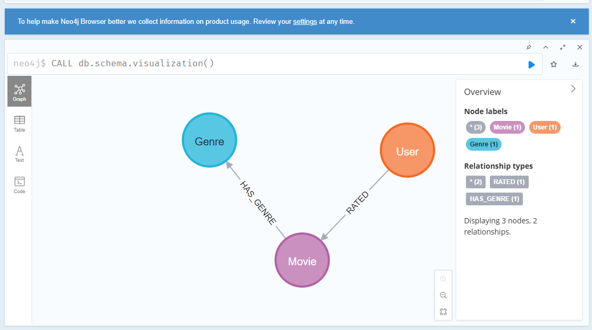
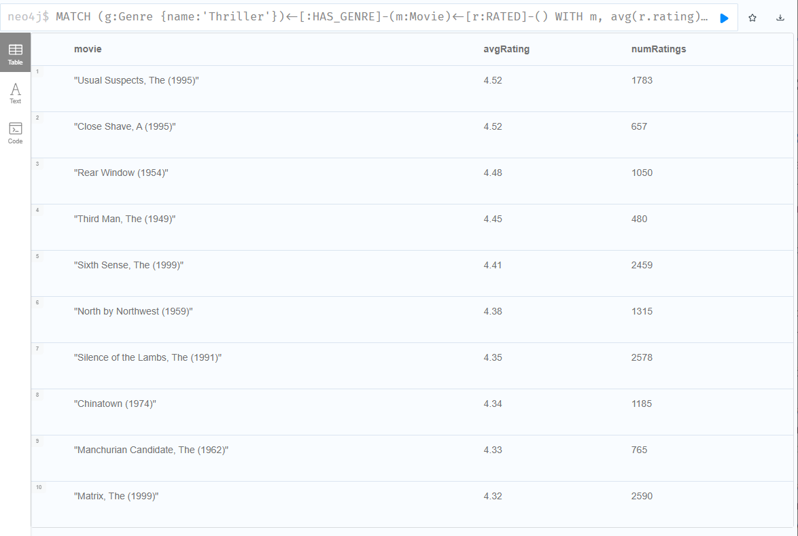
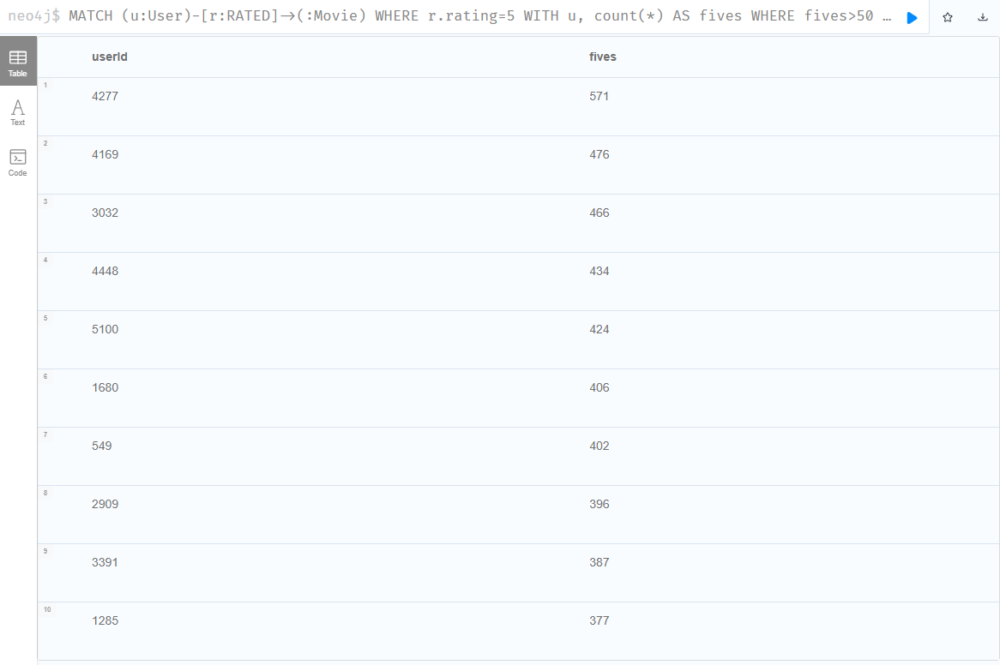
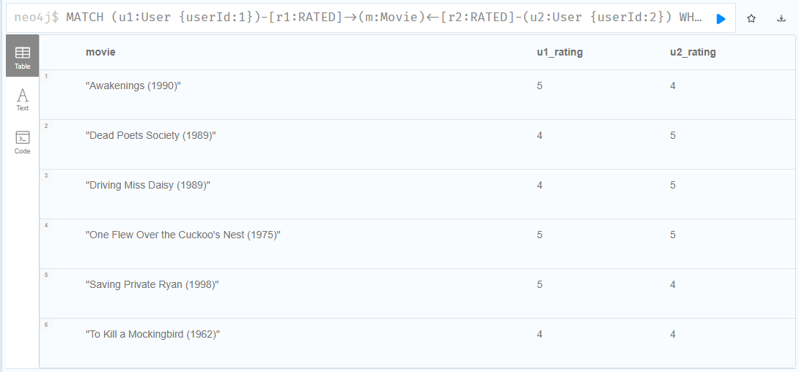
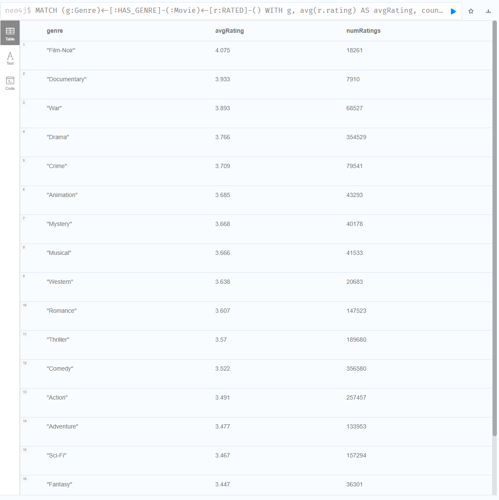
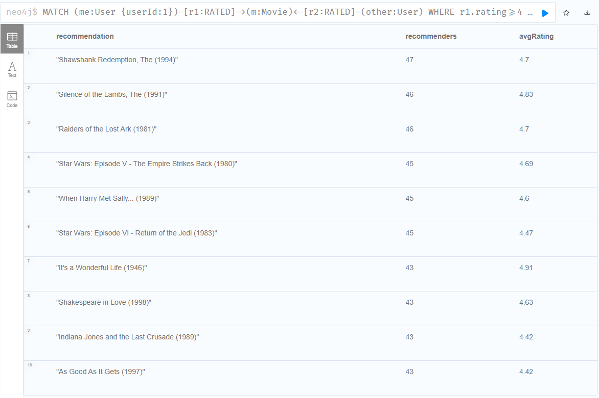
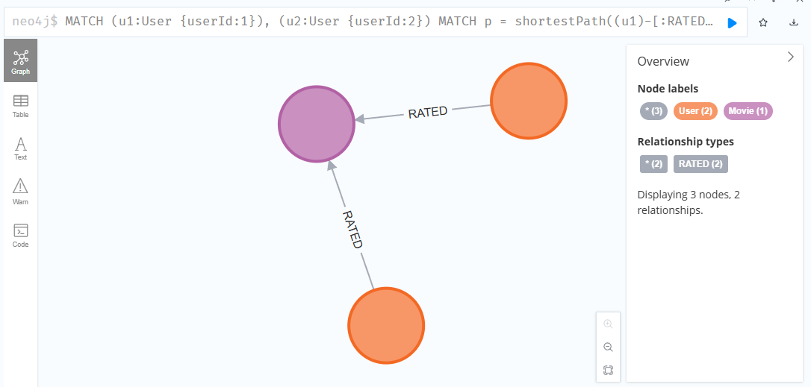
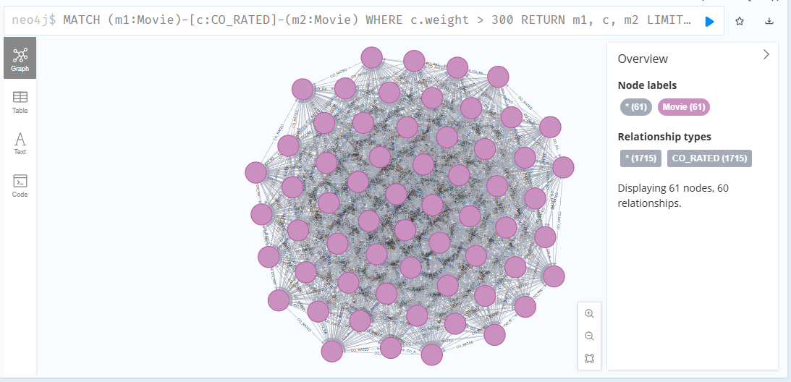
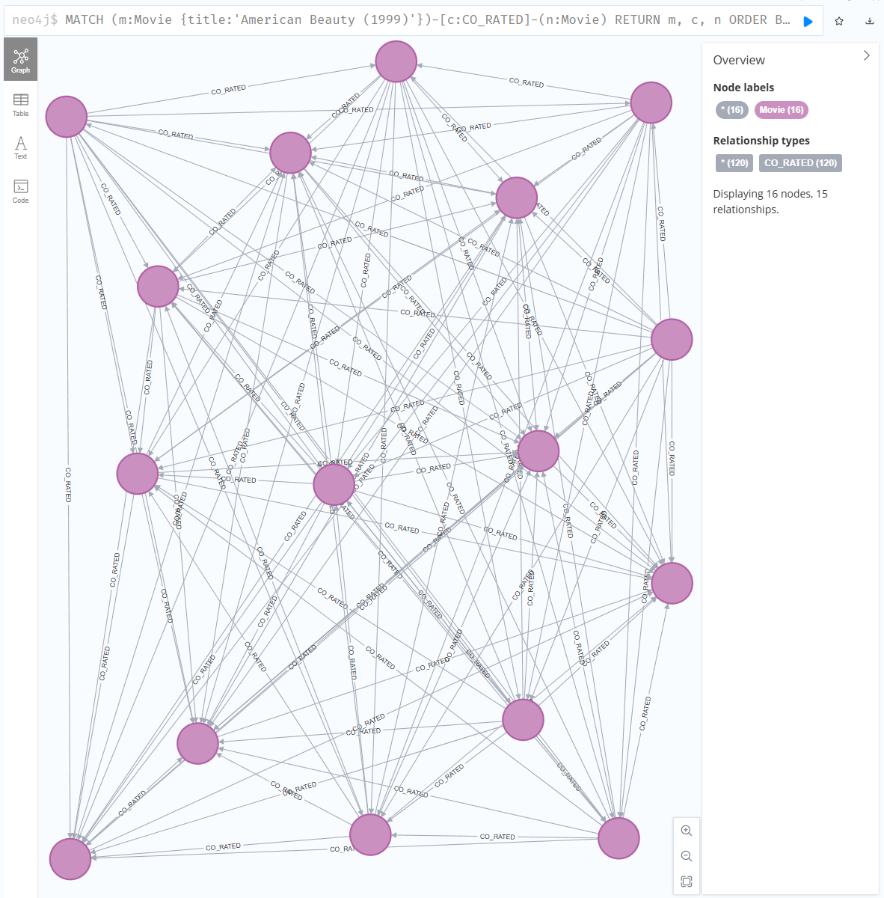

# Граф знань для рекомендаційної системи (MovieLens 1M, Neo4j)

Фінальне завдання курсу «NoSQL та векторні бази даних».
Будуємо рекомендаційний рушій на графі поверх датасету **MovieLens 1M**
(6040 користувачів, 3883 фільми, 1 000 209 оцінок).

---

## Як запустити

```bash
# 1. Розпакувати датасет і конвертувати .dat -> CSV
python convert.py            # створює import/movies.csv, users.csv, ratings.csv

# 2. Підняти Neo4j (APOC + GDS вже в образі)
docker compose up -d
# Neo4j Browser: http://localhost:7474   (neo4j / password123)

# 3. Завантажити дані та виконати запити (по черзі у Neo4j Browser або cypher-shell):
#    queries/part2_load.cypher
#    queries/part3.cypher
#    queries/part4_supernodes.cypher
#    queries/part5_gds.cypher
```

Версії: Neo4j 5.18-community, APOC 5.18.0, GDS 2.6.9.

---

## Частина 1 — Проєктування схеми

### Схема графа (ASCII)

```
                          HAS_GENRE
   ┌──────────────────┐  (M:N)        ┌──────────────┐
   │ :Movie           │──────────────▶│ :Genre       │
   │  movieId  (PK)   │               │  name  (PK)  │
   │  title           │               └──────────────┘
   │  year            │                  18 вузлів
   └──────────────────┘
            ▲                          супервузли:
            │ RATED                    Drama 1603, Comedy 1200 ...
            │  rating     (1..5)
            │  timestamp  (unix)
            │
   ┌──────────────────┐
   │ :User            │
   │  userId   (PK)   │
   │  gender          │
   │  age             │
   │  occupation      │
   └──────────────────┘

Вузли:   User (6040), Movie (3883), Genre (18)
Ребра:   (:User)-[:RATED {rating, timestamp}]->(:Movie)   ~1 000 209
         (:Movie)-[:HAS_GENRE]->(:Genre)                  6408
```

Властивості, що навмисно лишилися атрибутами (а не вузлами), бо жоден запит через
них не пивотує: `gender`, `age`, `occupation` (User); `title`, `year` (Movie).

Схема в Neo4j Browser (`CALL db.schema.visualization()`):



**Питання 1.** Які сутності стали вузлами, а які — ребрами? Чому?

Щоб вирішити, що в системі стане **вузлом**, що — **ребром**, а що — **властивістю**,
я виходжу з двох головних тез:

1. **Дві ноги, на яких стоїть система.** Спершу завжди треба визначити: (1) що в нас
   є в даних і (2) яку задачу ми розв'язуємо. Не можна пивотувати через дані, яких
   немає; і не варто плодити вузли, яких задача не вимагає.
2. **«model follows queries»** — структура графа визначається тими запитами, які
   система має обслуговувати.

Звідси прості критерії:

- **Вузол** — те, що є в даних і через що ми **пивотуємо** обхід (точка старту,
  фінішу або «перестрибування» пошуку).
- **Властивість** — те, що знадобиться лише для **фільтрації** вже досягнутих
  вузлів (фільтрувати за властивістю ≠ пивотувати через вузол).
- **Ребро** — те, що **зв'язує** вузли між собою: дія або відношення без власної
  ідентичності (воно існує тільки як з'єднання). Ребро теж може нести властивості.

Якщо уважно подивитися на всі 6 запитів частини 3, оптимальною виглядає така структура:

- **вузли:** `User`, `Movie`, `Genre`
- **ребра:** `RATED {rating, timestamp}`, `HAS_GENRE`
- **властивості:** `gender` / `age` / `occupation` на `User`, `title` / `year` на
  `Movie`, `name` на `Genre`

**Чому саме так (прив'язка до конкретних запитів):**
`Genre` — вузол, бо Запити 1 і 4 пивотують саме через жанр («інші фільми цього
жанру», «жанри зі стабільними оцінками») — а провалитися обходом у властивість-
список не можна. Натомість `occupation` / `age` / `gender` — властивості, бо **жоден**
із 6 запитів не входить у граф через демографію: максимум — це фільтр у
гібридному варіанті Запиту 5 (`WHERE other.gender = me.gender ...`), а фільтр
свойства не потребує окремого вузла. `title` / `year` / `timestamp` — високо-
кардинальні, майже унікальні значення, тож теж властивості.

**Питання 2.** Оцінка користувача за фільм — це ребро `(User)-[:RATED]->(Movie)`
чи окремий вузол `(Rating)`? Аргументація (trade-off-и обох підходів).

**Вердикт:** для цього датасету оцінка — це **ребро** `(User)-[:RATED {rating, timestamp}]->(Movie)`.

**Чому, виходячи з даних.** Рядок оцінки містить рівно 4 поля: `userId`, `movieId`,
`rating` (1–5), `timestamp` — і більше нічого. `rating` і `timestamp` беззмістовні
у відриві від пари (user, movie): це атрибути *самого зв'язку*, а не самостійної
сутності. До того ж кожна пара (user, movie) зустрічається рівно один раз
(1 000 209 рядків = 1 000 209 унікальних пар) — переоцінок немає, історії немає.
На оцінку ніщо не вказує. Отже, реіфікувати її в окремий вузол немає підстав.

**Trade-off-и обох підходів:**

| | ребро `RATED` | вузол `(Rating)` |
|---|---|---|
| хопів User↔Movie | 1 | 2 (User→Rating→Movie) |
| об'єктів на 1M оцінок | 1M ребер | +1M вузлів і 2M ребер |
| оцінка може бути кінцем чужого ребра? | ні | так |
| історія переоцінок одного екземпляра | втрачається при `MERGE` | кожна подія — свій вузол |

Тобто вузол коштує зайвого хопа та мільйона зайвих об'єктів — і платити за це варто
лише тоді, коли оцінка справді має власне «життя».

**Коли я б перемкнувся на вузол (момент-фліп).** Вузол потрібен рівно тоді, коли на
оцінку **вказує перша стрілка** — тобто вона стає джерелом або ціллю ще одного
ребра. Наприклад, якщо MovieLens перетворити на соцмережу про кіно: оцінка стає
рецензією, інші користувачі тиснуть «корисно» на чужу оцінку, коментують її,
вішають теги:

```
(User)-[:WROTE]->(Review {stars, text, timestamp})-[:OF]->(Movie)
(User)-[:FOUND_HELPFUL]->(Review)     // вхідна стрілка в оцінку → реіфікація
(Comment)-[:ON]->(Review)
(Review)-[:TAGGED]->(Tag)
```

Тоді стають можливими запити, що **пивотують через саму оцінку** («найкорисніша
рецензія на фільм», «топ рецензентів за лайками»), а пивотувати можна лише через вузол.

**Тонкість (щоб не сплутати у частині 6).** Аналіз поведінки користувача *в часі*
(«що він любив у 2000 vs 2003») **не потребує** вузла `Rating` — це вже безкоштовно
дає `timestamp` на ребрі `RATED`. Реіфікація купує не «час узагалі», а **ідентичність
конкретного екземпляра** оцінки (щоб на нього можна було послатися). Це різні речі.

**Питання 3.** Чому жанри вигідніше зберігати як окремі вузли `(Genre)`,
а не як список у властивості `Movie`?

Аргумент, чому жанр варто зробити вузлом, а не списком у властивості, складається
з трьох тез:

**1. Дедуплікація.** Замість того щоб тримати тисячі повторюваних рядків-жанрів
(тим паче що фільм зазвичай має кілька жанрів — усього 6408 призначень жанру),
дешевше зробити 18 вузлів `Genre`, на які посилаються фільми через `HAS_GENRE`.
Жанр «Action» зберігається один раз, а не дублюється в 503 фільмах. Утім, це **не
головний** аргумент — до питань суто економії даних повернемося в Частині 6.

**2. Запити вимагають обходу через жанр (головний аргумент).** У властивість-список
не можна «провалитися» обходом: щоб знайти «інші фільми цього жанру», довелося б
сканувати всі 3883 фільми і перевіряти входження в список. Вузол `Genre`
перетворює жанр на хаб, через який можна пивотувати. Цього вимагають **Запит 1**
(`всі фільми жанру Thriller із середнім рейтингом > 4.0`) і **Запит 4**
(`жанри зі стабільно високими оцінками`) — обидва входять у граф саме через
`(:Genre)`. (Запити 3 і 5 жанр не торкаються — це чисто поведінкові обходи
User↔Movie, тож в аргумент вони не йдуть.)

**3. Ціна — супервузли (але помірні).** Очевидно, що `Genre`-вузли стають
супервузлами. Але не найгігантськішими: дослідження даних показало, що чемпіон —
`Drama` з 1603 фільмами, далі `Comedy` 1200. Це тисячі ребер, не сотні тисяч.
Справжні монстри датасету — популярні фільми (тисячі `RATED`) і активні
користувачі (див. Частину 4).

**Додатково (межі застосовності, розгорну в Частині 6):** для суто фільтрувальної
задачі *без обходу* бітова маска жанрів у колонковій/реляційній БД (18 жанрів = 18
біт в одному `int`, фільтр через `AND`) була б компактнішою за ребра. Але в графовій
БД це оптимізація не тієї валюти: ребро (~34 байти) — це не «вага даних», а
предматеріалізований двонапрямлений вказівник (index-free adjacency), що робить
обхід O(1) замість O(N) скану. У графі за нього й платиш.

---

## Частина 2 — Завантаження даних

Скрипт: `queries/part2_load.cypher`. Пояснення кожного кроку.

**Крок 0 — індекси/constraint ДО завантаження.** Створюємо unique-constraint на
`User.userId`, `Movie.movieId`, `Genre.name`. Constraint — це одночасно й гарантія
унікальності, й індекс. Чому саме **до** ребер: під час завантаження 1М оцінок ми
для кожної робимо `MATCH (u:User{userId})` і `MATCH (m:Movie{movieId})`. Без індексу
кожен такий пошук — повний скан вузлів, тобто O(N) × 1 000 000. З індексом —
O(log N). Це різниця між хвилинами і годинами.

**Крок 1 — користувачі. `MERGE` замість `CREATE`.** `MERGE` спершу шукає вузол за
ключем і створює лише якщо не знайшов. Це робить скрипт **ідемпотентним**: повторний
запуск не наплодить дублів (критерій прийняття — «немає дублів»). `CREATE` сліпо
створив би другий комплект вузлів.

**Крок 2 — фільми + жанри.** Рік дістаємо з назви `"Toy Story (1995)"` —
`substring(..., size-5, 4)`. `split(genres,'|')` + `UNWIND` розкладає піп-список
жанрів у окремі рядки, далі `MERGE (g:Genre)` (дедуплікація — «Action» створиться
один раз на всі 503 фільми) і `MERGE` ребра `Movie->Genre`.

**Крок 3 — оцінки через `apoc.periodic.iterate`.** 1М ребер не можна вантажити
однією транзакцією — вона впаде по пам'яті або таймауту, бо тримала б 1М незакомічених
змін у heap. `apoc.periodic.iterate` розбиває роботу на батчі по 10 000 і комітить
кожен окремо.
- **`parallel: false`** — бо в тілі `MERGE` ребра: паралельні потоки могли б одночасно
  спробувати створити те саме ребро і влаштувати race/дедлок. `MATCH` вузлів сам по
  собі безпечний, але `MERGE` ребра — ні, тож не ризикуємо.
- **`MERGE` (а не `CREATE`)** ребра — знову ідемпотентність: повторний запуск не
  подвоїть оцінки (перевірено — `duplicate_pairs = 0`).

### Результат завантаження

| | завантажено | очікувалося |
|---|---|---|
| `:User` | 6040 | 6040 |
| `:Movie` | 3883 | 3883 |
| `:Genre` | 18 | 18 |
| `[:RATED]` | 1 000 209 | 1 000 209 |
| `[:HAS_GENRE]` | 6408 | 6408 |

Завантаження 1М ребер: **101 батч, ~23 c, 0 помилок**. Дублів `RATED` — **0**.

---

## Частина 3 — Запити різної складності

Скрипт: `queries/part3.cypher`. Для кожного запиту — що робить + перші рядки результату.
Скриншоти результатів з Neo4j Browser — під кожним запитом.

### Запит 1. Фільми жанру «Thriller» із середнім рейтингом > 4.0
Пивот від вузла `Genre{Thriller}` до фільмів жанру, агрегація `avg(rating)` на фільм,
фільтр > 4.0. `numRatings` показує «опору» середнього. **Порогу проходять 52 фільми.**

| movie | avgRating | numRatings |
|---|---|---|
| Close Shave, A (1995) | 4.52 | 657 |
| Usual Suspects, The (1995) | 4.52 | 1783 |
| Rear Window (1954) | 4.48 | 1050 |
| Sixth Sense, The (1999) | 4.41 | 2459 |
| Silence of the Lambs, The (1991) | 4.35 | 2578 |
| Matrix, The (1999) | 4.32 | 2590 |



### Запит 2. Користувачі, що поставили оцінку 5 більш ніж 50 фільмам
Фільтр ребер `rating=5`, `count` на користувача, фільтр > 50.
**Кваліфікуються 1390 користувачів.**

| userId | fives |
|---|---|
| 4277 | 571 |
| 4169 | 476 |
| 3032 | 466 |
| 4448 | 434 |
| 5100 | 424 |



### Запит 3. Фільми, які userId=1 і userId=2 обидва оцінили високо (≥4)
Один патерн `(u1)->(m)<-(u2)` ловить «трикутник» — у SQL це self-join таблиці ratings.

| movie | u1 | u2 |
|---|---|---|
| Awakenings (1990) | 5 | 4 |
| Dead Poets Society (1989) | 4 | 5 |
| Driving Miss Daisy (1989) | 4 | 5 |
| One Flew Over the Cuckoo's Nest (1975) | 5 | 5 |
| Saving Private Ryan (1998) | 5 | 4 |
| To Kill a Mockingbird (1962) | 4 | 4 |



### Запит 4. Жанри зі стабільно високими оцінками
Агрегація всіх оцінок фільмів кожного жанру. `numRatings` важливий для надійності avg.

| genre | avgRating | numRatings |
|---|---|---|
| Film-Noir | 4.075 | 18261 |
| Documentary | 3.933 | 7910 |
| War | 3.893 | 68527 |
| Drama | 3.766 | 354529 |
| ... | ... | ... |
| Horror | 3.215 | 76386 |

Цікаво: нішеві жанри (Film-Noir, Documentary) мають найвищий avg, а масовий Horror —
найнижчий. Менш популярні жанри дивляться ті, хто їх цілеспрямовано шукає → вищі оцінки.



### Запит 5. Рекомендація «схожі смаки також дивилися» (для userId=1)
(1) Знаходимо схожих — топ-50 користувачів за кількістю спільних високих оцінок.
(2) Беремо фільми, які ВОНИ оцінили ≥4, але користувач №1 ще НЕ бачив. Ранжуємо за
числом рекомендувачів. Результат — класика, що логічно для «середнього» глядача:

| recommendation | recommenders | avgRating |
|---|---|---|
| Shawshank Redemption, The (1994) | 47 | 4.7 |
| Silence of the Lambs, The (1991) | 46 | 4.83 |
| Raiders of the Lost Ark (1981) | 46 | 4.7 |
| Star Wars: Episode V (1980) | 45 | 4.69 |
| When Harry Met Sally... (1989) | 45 | 4.6 |



### Запит 6. Найкоротший ланцюжок між двома користувачами
`shortestPath` по ребрах `RATED` (ненапрямлено). Результат для (1, 2):

```
["User 1", "Awakenings (1990)", "User 2"]   довжина 2
```



**Питання до Запиту 6:**

1. **Що означає довжина шляху?** Один хоп — це крок по ребру `RATED` (User↔Movie).
   Шлях завжди чергує User–Movie–User–..., тож його довжина — це кількість таких
   кроків, а проміжні вузли — фільми (на парних позиціях) і користувачі-посередники
   (на непарних).
2. **Довжина 2 / 4 / 6:**
   - **2** = два користувачі оцінили **один і той самий** фільм (прямий спільний смак).
   - **4** = прямого спільного фільму немає, але є **один посередник**: u1 і u_x
     оцінили фільм A, u_x і u2 — фільм B. «Знайомий знайомого».
   - **6** = **два посередники** в ланцюгу (u1–A–u_x–B–u_y–C–u2).

   **Емпіричне спостереження:** у цьому датасеті майже будь-яка пара користувачів має
   довжину шляху **2** — навіть «далекі» (1↔6020 = 2 через «Ben-Hur»). Причина —
   супервузли: популярні фільми оцінені тисячами людей, тож зв'язують майже всіх
   напряму. Довжина 4+ трапляється лише між користувачами з дуже малою й
   неперетинною історією оцінок. Це прямий місток до Частини 4 (супервузли) і до
   «тісного світу» в Частині 5.3.

---

## Частина 4 — Виявлення супервузлів

Скрипт: `queries/part4_supernodes.cypher`.

**Питання 1. Які вузли — супервузли? Скільки в них зв'язків?**

Виявлено три класи супервузлів:

| клас | чемпіон | ступінь |
|---|---|---|
| Популярні фільми | American Beauty (1999) | **3430** |
| Активні користувачі | User 4169 | **2314** |
| Жанри | Drama | **1603** (Comedy 1200, Action 503...) |

Контекст по фільмах: `min=0, median=109, avg=257, p95=1033, max=3430` — довгий правий
хвіст (power-law). «Звичайний» фільм ~100 ребер, супервузол — тисячі (American Beauty
це ~13× медіани). Жанрів лише 18, але кожен — хаб.

**Питання 2. Чому запит по супервузлу повільніший за запит по звичайному вузлу
з тими ж індексами?**

Бо в запиті є **дві принципово різні операції**, і індекс прискорює лише одну:

1. **Lookup (пошук)** — знайти вузол за значенням властивості (`movieId`). Працює через
   індекс (B-tree), `O(log N)`. Це «прибуття» у вузол — і для супервузла, і для
   звичайного воно однаково швидке.
2. **Expansion (розкриття ребер)** — піти до сусідів. Це нативний обхід Neo4j: запис
   вузла прямо вказує на ребра, які зберігаються як зв'язний список (index-free
   adjacency). Індекс тут **не бере участі**. Вартість — `O(degree)`: розкрити American
   Beauty = пройти 3430 записів ребер, звичайний фільм = ~100.

На багатьох хопах вартості **перемножуються** (branching factor — як дерево): на
кожному хопі число шляхів множиться на середній ступінь вузлів фронту. Виміряно на
рекомендаційному обході для User 1:

```
старт → хоп1: 53 → хоп2: 60 146 → хоп3: 18 342 299 шляхів
        (×53)        (×1135)         (×305)
```

53 → 60 тис → 18 млн за три хопи; лише підрахунок цих шляхів — ~3 c. Причому сам User 1
**не** супервузол (53 оцінки) — вибух дали супервузли-**фільми** в середині шляху.
Тобто супервузол небезпечний у будь-якій точці обходу.

**Чому «з тими ж індексами» — це пастка у формулюванні:** індекс однаково швидко
приводить до обох вузлів, тож різниця у швидкості фізично не може бути в lookup — вона
цілком у фазі expansion, якої індекс не торкається.

**Питання 3. Яку стратегію з лекцій застосувати? (жанри — теж супервузли?)**

Стратегії з конспекту «Супервузли», застосовані до наших даних:

- **Стратегія 3 (денормалізація агрегатів)** — головний приём для Q1/Q4: зберігати
  `Movie.avgRating` / `numRatings`, `Genre.avgRating` як властивості й оновлювати при
  змінах, замість обходу 1M ребер `RATED` щоразу. Лекція рекомендує саме це для «гарячих
  лічильників і аналітики по супервузлах».
- **Стратегія 4 (фільтр через індекс / якорити на селективній стороні)** — заходити з
  боку малостепеневого вузла. Q3 стартує з двох User (низький ступінь), а не з фільмів;
  `LIMIT 50` у Q5 — та сама ідея «не розкривати супервузол повністю».
- **Стратегія 1 (проміжні вузли-агрегатори)** — у запасі для жанрів, якщо знадобиться
  глибокий обхід: `(Genre)-[:BY_DECADE]->(GenreDecade)<-[:HAS]-(Movie)`.

**Жанри — теж супервузли?** Так (Drama 1603). Але за критерієм лекції («хороша схема —
де максимальний ступінь лишається керованим; сигнал переглядати модель — коли вузол
притягує мільйони») жанровий супервузол **керований**: його ступінь — тисячі, не
мільйони, і їх лише 18. Тому правильний підхід — **прийняти** жанрові вузли як
неминучий і керований супервузол, а реальну біль (агрегація по 1M ребер у Q1/Q4)
лікувати **денормалізацією (Стратегія 3)**, а не ламати схему.

**Фундаментальний момент (стр. 5 конспекту):** фільми/користувачі-супервузли — як
«місто Берлін» з лекції: це властивість самих даних (популярний фільм *зобов'язаний*
мати тисячі оцінок), а не помилка проєктування. Тож ми їх **приймаємо й пом'якшуємо
по-запитно** (Стратегії 3, 4), а не намагаємось усунути. Якби ступінь ріс до мільйонів —
лекція пропонує шардування або іншу СУБД (FalkorDB з матричним поданням замість
зв'язного списку ребер).

---

## Частина 5 — Графові алгоритми (GDS)

Скрипт: `queries/part5_gds.cypher`. GDS працює з проєкцією графа в пам'яті —
це окремий крок (`gds.graph.project`), бо алгоритми не торкаються збереженого графа.

### 5.1. PageRank на графі фільмів
Граф: `Movie`, ребра `CO_RATED` (50000 найсильніших) — фільми, які високо оцінили
спільні користувачі. Топ-10 за PageRank:

| movie | pagerank | numRatings |
|---|---|---|
| American Beauty (1999) | 9.659 | 3428 |
| Star Wars: Episode IV (1977) | 9.136 | 2991 |
| Raiders of the Lost Ark (1981) | 7.939 | 2514 |
| Fargo (1996) | 7.032 | 2513 |
| Godfather, The (1972) | 6.314 | 2223 |
| Matrix, The (1999) | 6.288 | 2590 |

Граф `CO_RATED`, на якому працював PageRank (Neo4j Browser) — щільне ядро co-оцінених
популярних фільмів:



А це **его-мережа** фільму з найвищим PageRank — `American Beauty`: у центрі сам фільм,
навколо — 15 фільмів, які найчастіше co-оцінюють високо разом з ним. Густа павутина між
сусідами означає, що ці фільми ще й **взаємно** co-оцінені — тобто `American Beauty`
сидить усередині щільно зв'язаного кластера «спільно улюблених» фільмів. Саме це й дає
йому високий PageRank: алгоритм винагороджує не просто багато ребер, а **центральність
у щільному оточенні інших важливих, добре пов'язаних вузлів**.



**Питання: високий PageRank — це просто «популярний фільм» чи щось інше?**

Не просто популярний. PageRank вимірює **центральність у мережі «що люблять разом»**:
фільм важливий, якщо його co-оцінюють високо разом з іншими добре пов'язаними фільмами
(eigenvector-логіка: ти важливий, якщо з тобою співіснують важливі вузли). Доказ — PR
розходиться з простим лічильником оцінок: **Godfather (2223 оцінки) має вищий PageRank
(6.314), ніж Return of the Jedi (2883 оцінки, 5.6)** — Jedi оцінили БІЛЬШЕ людей, але
PR нижчий. Тобто PageRank ловить не «скільки людей подивилось», а «наскільки фільм у
центрі смакового консенсусу» — культові фільми, які cinephiles люблять разом з іншими
канонічними, утворюють щільне центральне ядро й отримують високий ранг.

### 5.2. Louvain — спільноти користувачів
Граф: `User`, ребра `SIMILAR` (спільні фільми з rating=5). Результат: **4574 спільноти,
modularity = 0.168, 2 рівні**. Більшість — одинаки (користувачі без `SIMILAR`-ребра в
топ-50000). Реальні спільноти — чотири великі: **821, 310, 259, 80** користувачів.

**Питання 1: чи відповідають кластери інтуїтивним групам?**

Залежно від методу аналізу. «У лоб» (топ-3 жанри за raw count) — **ні**: усі спільноти
мають однакові Drama/Comedy/Action, бо це просто найпопулярніші жанри (base rate). Але
після нормування на базову частоту (**lift** = перепредставленість жанру відносно
середнього) — **так, чіткі інтуїтивні групи проявляються**:

| спільнота | відмінні жанри (lift) | інтерпретація |
|---|---|---|
| 4343 | Film-Noir 1.64x, Documentary 1.63x, Musical 1.43x, Western 1.37x | **арт-хаус / класика** |
| 5681 | Children's 1.29x, Action 1.27x, Adventure 1.25x, Fantasy 1.25x | **блокбастери / сімейне** |
| 751 | Documentary 2.35x, Crime 1.24x | **док / кримінал** |
| 4168 | слабкі lift (~1.1x) | **мейнстрим-універсали** |

Це ровно «цінителі арт-хаусу» (4343) проти «любителі бойовиків» (5681) з умови.

**Питання 2: як я це перевірив?** Трьома зрізами: (1) топ-3 жанри за raw count — показали,
що в лоб кластери не різняться; (2) гендерний склад — теж однаковий (~75% M скрізь, як і
весь датасет); (3) **lift по жанрах** — і лише він розкрив справжні смаки. Методичний
висновок: raw count вводить в оману через base rate, нормування обов'язкове.

**Чому modularity низька (0.168)?** Смаки сильно перетинаються — всі дивляться мега-
популярні фільми, тож чистого поділу на «племена» немає. Це чесний результат, а не
помилка: спільнотна структура слабка, але вона є.

### 5.3. Dijkstra — найкоротший шлях між користувачами
Та сама проєкція `userSimilarity`. Приклади (hops = кількість кроків):

| пара | hops | ланцюг |
|---|---|---|
| 17 → 34 (одна спільнота) | 3 | 17 — 1746 — 1835 — 34 |
| 10 → 44 (одна спільнота) | 2 | 10 — 1051 — 44 |
| 17 → 81 (різні спільноти) | 2 | 17 — **4169** — 81 |
| 10 → 161 (різні спільноти) | 2 | 10 — 1322 — 161 |

**Питання 1: наскільки «тісний світ»?** Дуже тісний. Майже будь-яка пара користувачів
з'єднується за **2-3 хопи**, навіть між різними спільнотами. Цікаво: посередником у
крос-кластерних шляхах двічі виступив **User 4169** — найактивніший користувач
(супервузол з Частини 4), тобто супервузли працюють як «брокери» між спільнотами.

**Питання 2: середня довжина шляху + гіпотеза «шести рукостискань».** По вибірці з 12
користувачів (66 пар): **середня довжина = 2.17 хопа** (55 пар по 2, 11 по 3, максимум
3). Гіпотеза «шести рукостискань» не просто підтверджується — світ **значно тісніший за
шість**. Застереження: граф `SIMILAR` — це топ-50000 найсильніших ребер (pruned top-K
projection), тож він щільніший за повний латентний граф схожості, а користувачі поза ним
(одинаки) недосяжні. Тож «2.17» стосується зв'язного ядра схожості, а не буквально всіх
6040 користувачів.

---

## Частина 6 — Аналіз і висновки

**1. Граф vs SQL. Які запити частини 3 складно або неможливо написати в SQL?**

Найпоказовіший приклад — **Запит 6 (найкоротший ланцюжок між двома користувачами)**.
Чесне формулювання: у SQL він **можливий, але катастрофічно гірший** — і саме *чому*
гірший і є суттю переваги графа.

У Cypher це один рядок:
```cypher
MATCH p = shortestPath((u1:User {userId:1})-[:RATED*..10]-(u2:User {userId:2}))
RETURN p
```
Ключове — `*..10`: обхід **змінної довжини**, бо довжина шляху заздалегідь невідома.

**Чому в SQL боляче — по наростаючій:**

*Фіксованими JOIN-ами — не вийде.* Кожен хоп user→movie→user — це self-join таблиці
`ratings`. Але скільки їх писати? Два join-и знайдуть лише шлях довжини 2, три —
довжини 3. `shortestPath` не знає довжину наперед, тож фіксованим SQL це непредставне.

*Єдиний шлях — рекурсивний CTE:*
```sql
WITH RECURSIVE paths AS (
    SELECT 1 AS current_user, ARRAY[1] AS visited, 0 AS depth
  UNION ALL
    SELECT r2.userId, p.visited || r2.userId, p.depth + 1
    FROM paths p
    JOIN ratings r1 ON r1.userId = p.current_user
    JOIN ratings r2 ON r2.movieId = r1.movieId AND r2.userId <> p.current_user
    WHERE r2.userId <> ALL(p.visited)   -- цикли гасимо вручну
      AND p.depth < 10
)
SELECT * FROM paths WHERE current_user = 2 ORDER BY depth LIMIT 1;
```

15 рядків проти одного — але справа не в довжині, а в трьох вадах:

1. **JOIN перераховується на кожному хопі.** Щоб розкрити сусідів одного користувача,
   SQL щоразу join-ить таблицю `ratings` саму на себе по 1М рядків. У Neo4j зв'язок —
   це вже **матеріалізований вказівник** (index-free adjacency), розкриття сусіда —
   O(1). У SQL adjacency немає, вона **обчислюється join-ом наново** щохопа.
2. **Вибух фронту без ранньої зупинки.** Рекурсивний CTE матеріалізує весь фронт до
   depth 10 і лише потім фільтрує target. Через супервузол (American Beauty, 3430
   ребер) це комбінаторно вибухає. А `shortestPath` робить **двонапрямлений BFS і
   зупиняється при першій зустрічі** — вбудована оптимізація, якої в наївного CTE немає.
3. **Цикли руками** — масив `visited` і перевірка `<> ALL(...)`, що крихко й росте.

**А чи врятують індекси?** Частково. Індекси на `ratings(userId)` і `ratings(movieId)`
переводять кожен lookup зі скану O(N) у B-tree-пошук O(log N) — без них CTE безнадійний.
Але гэп вони **не закривають**: (а) кардинальність фронту незмінна — індекс пришвидшує
*пошук* сусіда, а не *кількість* сусідів; (б) **індекс ≠ алгоритм** — B-tree не дає
двонапрямленого BFS; (в) індекс на join-колонці — це лише *спроба збудувати adjacency
збоку*, і кожен сусід усе одно коштує log-N пробивки проти O(1)-вказівника графа.

**А хоч процедурою?** Можна написати храниму процедуру (PL/pgSQL), що реалізує сам BFS —
це закриє гэп *алгоритму*. Але не гэп *зберігання*: кожен крок усе одно пробиває B-tree
замість розіменування вказівника, плюс накладні витрати на temp-таблиці фронту. І
головне — це вже **не SQL**, а самописний графовий рушій усередині РСУБД, який ти сам
пишеш і підтримуєш.

**Концептуальна суть:** SQL — множинно-орієнтований (операції над relations), а
найкоротший шлях — **навігаційна** задача (йти вказівниками). Граф зберігає зв'язок як
**передобчислений join**, тож обхід безкоштовний; SQL перераховує join щоразу. Саме
тому перевага зветься **index-free adjacency**: сила графа не в тому, що індекс є, а в
тому, що він **не потрібен** — adjacency *і є* способом зберігання.

**Доказ із індустрії:** вендори прибудовують графові рушії до реляційних БД саме тому,
що робити це руками боляче — SQL Server *graph tables*, Oracle *PGQL*, розширення
**Apache AGE** (openCypher усередині PostgreSQL). Якби індекси й процедури вирішували
питання задарма — графових БД як категорії не існувало б.

**2. Де граф програє? Для яких задач реляційна модель підійшла б краще?**

Симетрично до переваги графа: він сильний у **«глибоко й локально»** (мало точок
старту, багато хопів, навігація), а **програє у «мілко й глобально»** — коли запит
має торкнутися **всіх** даних і **агрегувати**, а не обходити. У таких задачах головна
суперсила графа (index-free adjacency) **не вмикається взагалі**, бо хопів немає, а його
модель зберігання стає тягарем. Конкретно з нашим датасетом реляційна модель виграла б у:

1. **Масові агрегації / OLAP.** Саме наші **Запит 4** (середній рейтинг по всіх оцінках
   кожного жанру) і **Запит 2** (кількість п'ятірок на користувача) — це повний скан +
   `GROUP BY`, без жодного обходу. Колонкова/реляційна БД зі scan-оптимізованим
   зберіганням тут швидша, бо читає дані послідовно й стискає їх (dictionary, RLE), чого
   граф не вміє.

2. **Звіти, табличний експорт, BI.** Вивантажити всі оцінки у CSV, побудувати дашборд
   чи плоский звіт — це рідна територія реляційки. Дані MovieLens за природою табличні
   (`user, movie, rating, timestamp` — ідеальний рядок), і повертати їх **пласкою
   таблицею (рядки × стовпці)** простіше там, де вони так і лежать — реляційний `SELECT`
   віддає таку таблицю нативно, тоді як граф довелося б розплющувати свої вузли та шляхи
   у рядки.

3. **Зберігання однорідних даних + супервузли.** Оцінку дешевше тримати рядком, ніж
   ребром (34 байти + relationship chains проти упакованого колонкового рядка). Ще
   яскравіший приклад — **жанри під суто фільтрувальною задачею без обходу** («які фільми
   жанру X»): у реляційній/колонковій БД 18 жанрів пакуються у 18-бітну маску в одному
   `int`, а фільтр — це швидкий бітовий `AND`. Граф натомість платить ~34 байти за кожне
   ребро `HAS_GENRE` заради index-free adjacency, яка у *чистому фільтрі* (без пивоту до
   «інших фільмів жанру») просто не задіюється. Тобто там, де треба лише фільтрувати, а
   не ходити зв'язками, компактний бітовий стовпець б'є ребро і за обсягом, і за
   швидкістю. До того ж супервузли, які в графі гальмують обхід (Частина 4), у SQL — це
   просто `GROUP BY` по індексованій колонці.

**Суть:** там, де задача не «йти зв'язками», а «прочитати все й згорнути», граф не
додає нічого, а коштує більше. Гарна архітектура — це не «граф замість SQL», а **граф
для навігації + реляційна/колонкова БД для аналітики й звітності** (звідси й гібридні
рішення на практиці).

**3. Покращення схеми. Які зміни прискорили б конкретні запити з частини 3?**

Два конкретні покращення, кожне прив'язане до запитів:

**Покращення 1 — денормалізація `Movie.avgRating` + `Movie.numRatings`.**
Зараз **Запит 1** (триллери з avg > 4.0) і **Запит 4** (середній рейтинг по жанрах)
щоразу **обходять усі ребра `RATED`** і рахують `avg()` наживо — це мільйонний скан на
кожен запуск. Якщо порахувати середній рейтинг і кількість оцінок **один раз** і
зберегти їх властивостями вузла `Movie`, то:
- **Запит 1** стає простим фільтром `WHERE m.avgRating > 4.0` серед фільмів жанру (ще й
  з індексом на `avgRating`), без розкриття жодного ребра оцінки;
- **Запит 4** агрегує вже готові per-movie середні по жанрах замість 1М ребер.

Ціна (за конспектом, Стратегія 3) — денормалізація порушує чистоту графа: агрегат треба
**оновлювати при кожній новій оцінці**, інакше він застаріє. Для «гарячої» аналітики це
розумний компроміс швидкість/чистота.

**Покращення 2 — матеріалізовані ребра `(User)-[:SIMILAR {weight}]->(User)`.**
**Запит 5** (рекомендація) зараз робить 3-хоповий обхід `user→movie→user→movie`, який
вибухає (виміряно: 53 → 60k → 18M шляхів). Якщо **один раз** порахувати топ-K
найсхожіших користувачів для кожного й зберегти це ребрами `SIMILAR`, то рекомендація
згортається з 3 хопів у **1 хоп** уздовж готових ребер + крок до їхніх фільмів. Це ровно
та проєкція, яку ми будували в Частині 5 (тільки тут вона лишається в графі постійно як
частина схеми, а не тимчасово).

**Спільна ідея обох покращень** — це **передобчислення** (Стратегія 3 з Частини 4):
перенести важку роботу з *часу запиту* на *час запису*, торгуючи свіжістю даних і
місцем на диску за швидкість читання. Класичний трейд-оф денормалізації.
