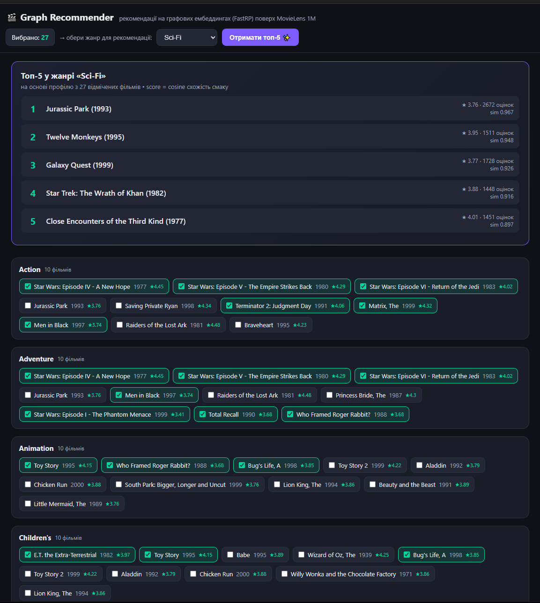

# 🎬 Bonus — рекомендатор на графових ембеддингах

Невеликий веб-застосунок поверх основного ДЗ: рекомендує фільми на основі
**графових ембеддингів** і **векторного пошуку**. Це «..and one more thing» —
замикає всю дугу курсу: документи (Mongo) → вектори (Pinecone) → граф (Neo4j) →
**граф ЯК вектори**.



## Ідея

1. **Граф → вектори.** `gds.fastRP` будує кожному фільму вектор (256-вим) з його
   положення у графі `CO_RATED` (фільми, які високо оцінюють спільні користувачі).
   Жодного тексту чи жанрів — лише структура «що люблять разом».
2. **mean-centering.** На щільному графі блокбастери майже колінеарні (спільна
   компонента «популярність»). Віднімаємо середній вектор → лишається «смак».
3. **Профіль = середній вектор** відмічених користувачем фільмів.
4. **Рекомендація = векторний пошук**: cosine(профіль, фільм) серед фільмів обраного
   жанру, яких користувач ще не відмічав → топ-5. Вектори тут структурні, але сам
   пошук — той самий cosine kNN, що й у векторних БД (HW2).

## Що показав тест

Однаковий цільовий жанр, різні профілі → різні рекомендації:
- профіль «екшн/sci-fi» → Drama: *Saving Private Ryan, Braveheart, Shawshank*;
- профіль «сімейне/анімація» → Drama: *Stand by Me, Breakfast Club, Good Will Hunting*.

Персоналізація працює.

## Запуск

```bash
# 0. Neo4j має бути піднятий (docker compose up -d у корені проєкту)
# 1. Один раз — побудувати ембеддинги (пише Movie.embedding):
#    виконати build_embeddings.cypher у Neo4j Browser / cypher-shell

# 2. Backend (Python 3.12):
cd bonus_recommender
python -m venv .venv && .venv/Scripts/pip install fastapi "uvicorn[standard]" neo4j numpy
.venv/Scripts/uvicorn app:app --port 8000

# 3. Відкрити http://localhost:8000
```

## Структура

```
build_embeddings.cypher   # FastRP -> Movie.embedding (+ денормалізація avg/num)
app.py                    # FastAPI: ембеддинги в пам'ять, /api/genres, /api/recommend
static/index.html         # ванільний фронт (без збірки)
test_embeddings.py        # перевірка якості ембеддингів (cosine-сусіди)
```

## Обмеження (чесно)

- Валідні ембеддинги мають ≈**794** «ядрові» фільми (ті, що в графі `CO_RATED`,
  тобто популярні з >20 оцінок). Нішеві старі фільми поза покриттям — для рекомендатора
  впізнаваних фільмів це навіть плюс, але повнота обмежена.
- Дані 2000 року (MovieLens 1M) — нових фільмів немає.
